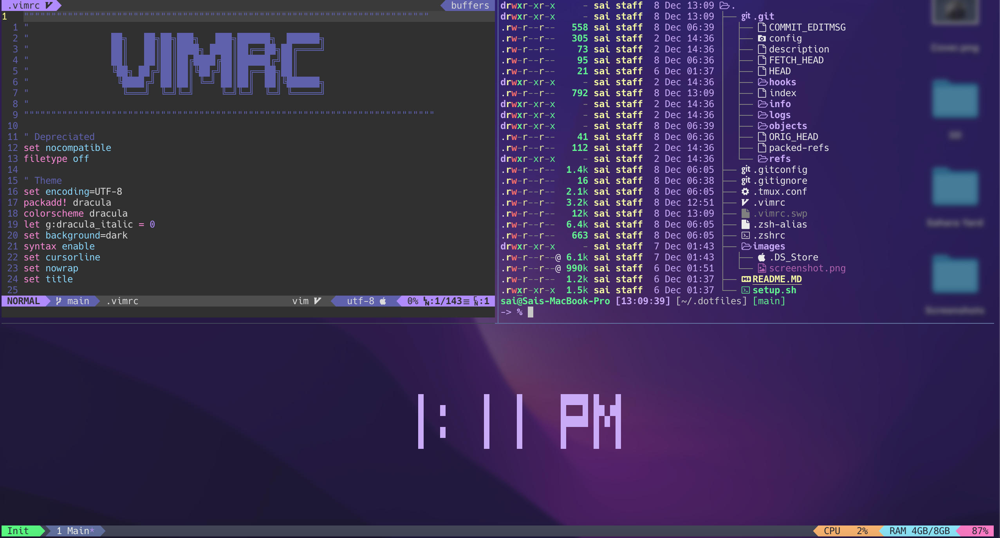

# DOTFILES

A repository that contains dotfiles for :
- [Vim](.vimrc)
- [ZSH](.zshrc)
- [Git](.gitconfig)
- [Tmux](.tmux.conf)

## Requirements

- Default shell should be Zsh
- Oh my Zsh
- Git, Tmux and Vim should be installed

## Installation 

**You do not have to backup your current dotfiles, This will prefix your current dotfiles with .backup** 

- Install Oh my Zsh `sh -c "$(curl -fsSL https://raw.github.com/ohmyzsh/ohmyzsh/master/tools/install.sh)"`
- Get a new terminal or source zshrc file again to get new oh-my-zsh environment variables `source ~/.zshrc`
- Install auto suggestions ```
        git clone https://github.com/zsh-users/zsh-autosuggestions.git $ZSH_CUSTOM/plugins/zsh-autosuggestions
        git clone https://github.com/zsh-users/zsh-syntax-highlighting.git $ZSH_CUSTOM/plugins/zsh-syntax-highlighting
        ```
- Move to home directory `cd ~`
- Get this repository `git clone https://github.com/r4ksai/.dotfiles.git`
- Move into .dotfiles `cd .dotfiles`
- To install the dotfiles run `./setup.sh`

**You need to add Dracula theme to the terminal manually**

### Only linking

**Use this only to link dotfiles, this does not contain installation**

To only link the dotfiles run `./setup.sh link`

### Package Installation

To install Packages run `./setup.sh install`

### Install Font to support  Icons

**For this to take effect you need to change the terminal font to the installed font**

### Install Plugins for Vim or Nvim

**To install plugins using plugin manager run `:PlugInstall` inside vim or neovim**

### Remove dotfiles

To remove dotfiles run `./setup.sh clean`
